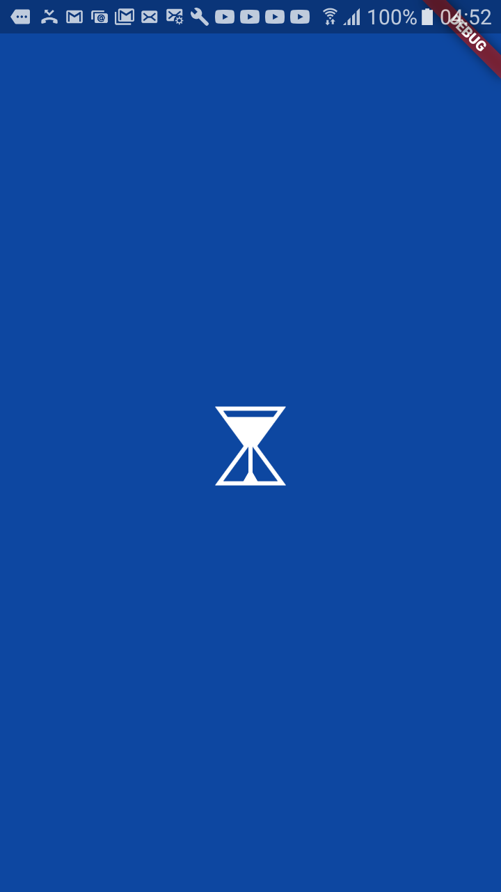
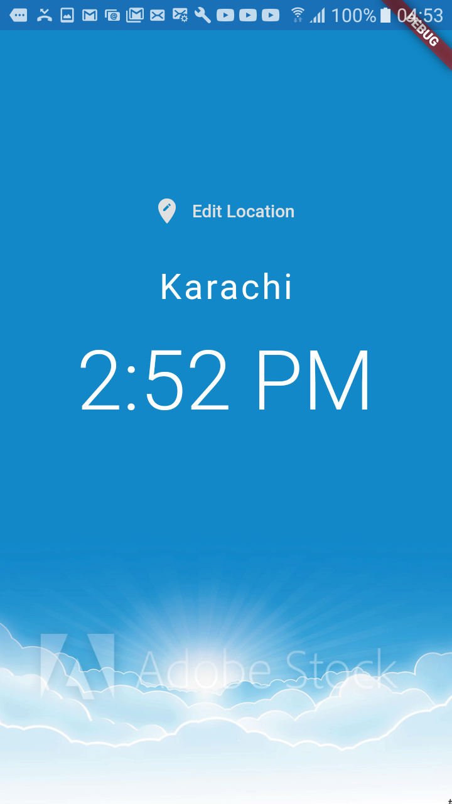
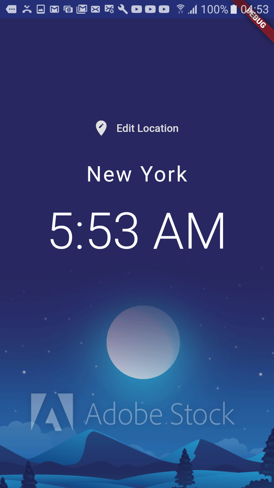
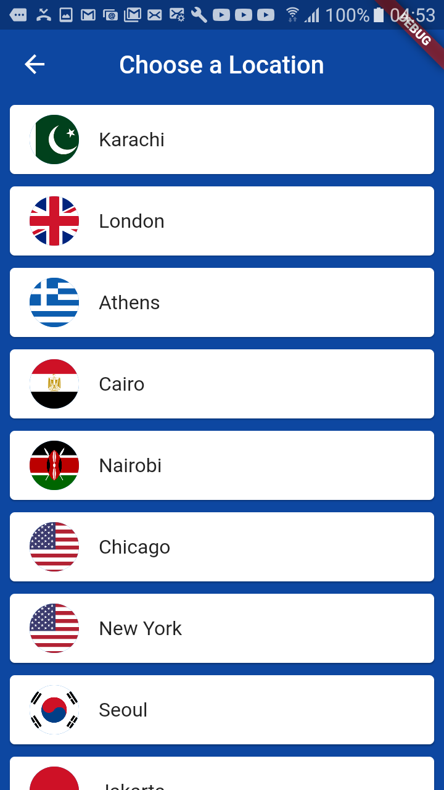

# World Time (Mobile Application)

I was following [Flutter for Beginners](https://www.youtube.com/watch?v=1ukSR1GRtMU&list=PL4cUxeGkcC9jLYyp2Aoh6hcWuxFDX6PBJ) tutorial while learning flutter basics and I made this application.

## Technology and platform
Framework: flutter

Platroms: Android and ios
1. Android -> Developed and tested
2. ios -> developed (not tested yet)

## Challange in implementation
After I implemented the code I realized that there was some problem with the time of places whose timezone is *-GMT* and I corrected it by applying this logic: 
```
sign == '+' ? now = now.add(Duration(hours: int.parse(offset))) : now = now.subtract(Duration(hours: int.parse(offset)));
```
I caught the string from [World Time API](http://worldtimeapi.org) and then tested if it was *+GMT or -GMT*. Then I applied this logic so that correct time would be displayed.

## Completed Design
|Loading Page|Home Page Day|Home Page Night|Edit Location|
|---|---|---|---|
|||||

## Follow me
Linked in: 
[Mahnoor Rizwan](https://www.linkedin.com/in/mahnoor-rizwan-b7657818b/) 
